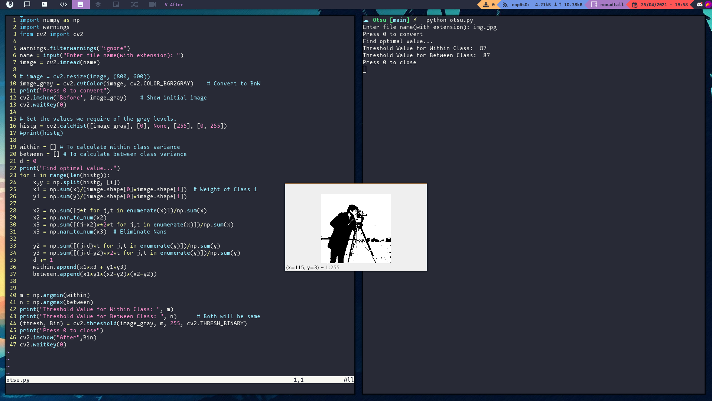

# Otsu Thresholing

This is a simple implementation of OTSU's thresholding method to separate the background and foreground of an image.



## Download

```
git clone https://github.com/HotMonkeyWings/OTSU_Thresholding.git
cd OTSU_Thresholding
```

## Run

```
python otsu.py
```

Once you run it, enter the filename with the extension to what you need to find the threshold value for.


